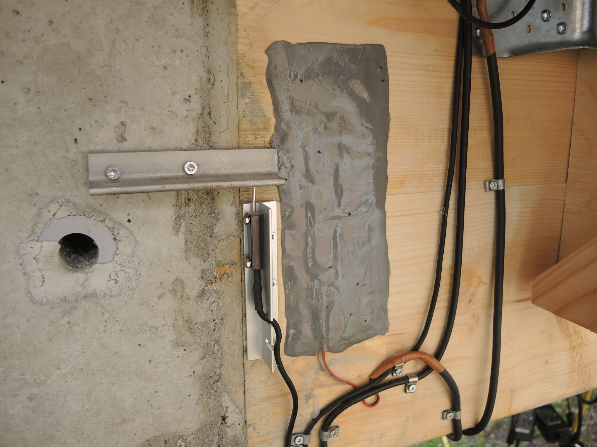
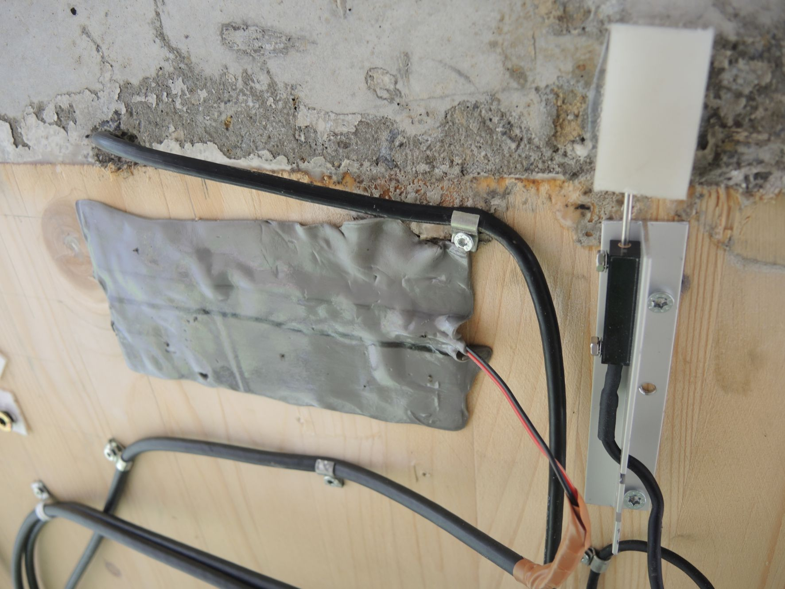

<iframe width="1200" height="800" frameborder="0" scrolling="no" src="https://plot.ly/~AbteilungHolz/49.embed"></iframe>

Foto eines Wegsensors zur Messung der vertikalen Verschiebung zwischen Holztr&auml;ger und Beton-Auflager am integralen Stoss

Foto des Wegsensors zur Messung der horizontalen Verschiebung zwischen Holztraeger und Beton-Auflager an der Traegerunterseite am integralen Stoss
